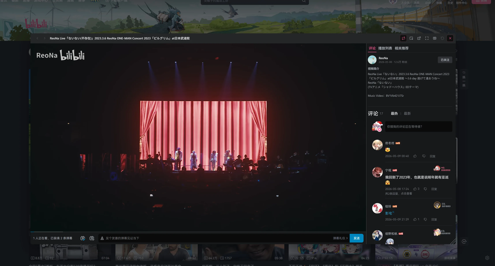
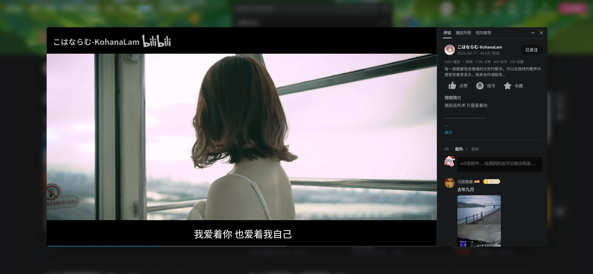

# Bilibili Popup Player - Nano

## 预览

### 网页小窗



### 评论侧栏



## 安装

访问 [pop-player.nanachi.moe](https://pop-player.nanachi.moe/)，按页面提示安装即可。

安装本地构建时，在 ScriptCat（脚本猫）或 Tampermonkey（油猴）中导入根目录的 `bilibili-popup-player-nano.user.js`，`dist` 中的同名文件也可使用。文件开头应为 `// ==UserScript==`；构建过程会验证这个元数据头，缺失时终止构建。

许可正文保存在独立文件中，脚本头仅保留 `@license` 标识。

独立小窗按 `documentPictureInPicture.requestWindow` 是否可用来启用，不按浏览器名称或版本屏蔽。Firefox 桌面版自 [151](https://www.firefox.com/en-US/firefox/151.0/releasenotes/) 起支持 Document PiP；接口不可用时仍可使用网页小窗。

## 本地调试

```sh
pnpm install
pnpm run dev
```

然后在用户脚本管理器里安装根目录的 `bilibili-popup-player-nano.dev.user.js`。这个 dev loader 会从 `http://127.0.0.1:8715/bilibili-popup-player-nano.user.js` 拉取本地 bundle；改动源码后 Rollup 会自动重建，已打开的 B 站页面会自动刷新。

## 验证

```sh
pnpm build
pnpm check
pnpm test
pnpm test:browser
```

浏览器回归使用本机 Chrome，也可通过 `PLAYWRIGHT_CHANNEL=msedge` 选择 Edge。测试覆盖 OGV 与历史浮层挂载、遮挡和裁剪、SPA 与卡片复用、总开关、键盘操作、光标与播放标记、切回窗口防误关、播放器比例、迷你窗口与独立小窗的生命周期。播放接口和媒体实例使用测试替身；真实媒体加载、账号权限及 Document PiP 行为仍需在 B 站页面验证。

## 发布

```sh
pnpm run release
```

默认自动 bump patch 版本并发布到 Cloudflare Pages。指定版本：

```sh
pnpm run release -- 0.3.0
```

## 架构

- 共用卡片扫描、封面点击拦截、播放页 SSR 解析、主题 CSS、评论组件、调试入口。
- 设置入口和普通卡片按钮渲染在页面级 shadow overlay 中；历史记录等悬停浮层的按钮挂载到卡片内部的独立 shadow root，以保留浮层的悬停状态，销毁时清理挂载点和定位样式。
- `card-targets.js` 负责真实封面识别、可见区域与遮挡检测；播放页排除当前视频，OGV 选集不挂入口。
- `settings-ui.jsx`、`player-shell-ui.jsx` 和 `content-ui.jsx` 使用 Base UI 的 Popover、Switch、Radio、Dialog、Tabs 与 Button；`ui-theme.js` 统一样式。
- 评论组件保留在我们自己的 modal/PiP 容器内。
- 播放容器通过 renderer adapter 区分：
  - `homeRenderer`：当前网页内 modal / 右下角迷你播放器。
  - `pipRenderer`：支持 Document Picture-in-Picture 的浏览器独立小窗。
- 评论区统一走 `window.BiliComments`，切视频优先 `comment.methods.reload(props)`，否则 fallback 到 `dispatchAction({ type: "reload" })`。

## 入口

```js
window.__biliPopupPlayerNano
window.__biliPopupPlayerNanoDebug
```

## 许可

本项目采用 [GNU Affero General Public License v3.0](LICENSE)（`AGPL-3.0-only`）。第三方依赖保留各自许可，见 [THIRD_PARTY_NOTICES.txt](THIRD_PARTY_NOTICES.txt)。B 站播放器、评论组件及预览中的视频内容属于其各自权利人，不在本项目许可范围内。
