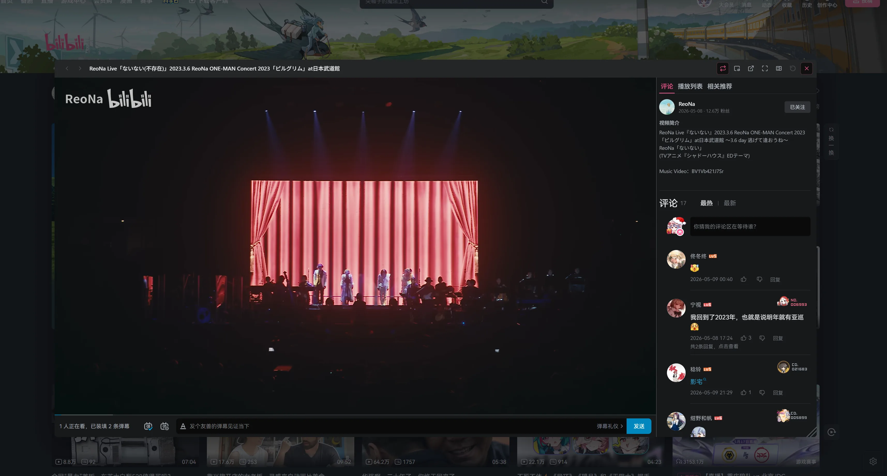
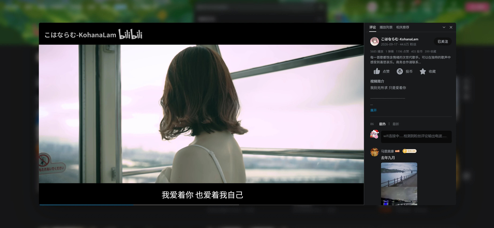

# Bilibili Popup Player

在 B 站边看视频边浏览页面，支持网页小窗、迷你播放器和独立小窗。

## 功能

- 从视频封面打开小窗，也可开启「点击封面播放」。
- 支持普通视频、番剧和直播。
- 在小窗中查看评论、视频信息、分 P 和播放列表。
- 支持主题配色、快捷键和迷你播放器。
- 兼容 BewlyCat、BewlyBewly 的视频卡片；具体范围见 [兼容性记录](test/manual/compatibility.md)。

独立小窗依赖浏览器的 Document Picture-in-Picture 支持，申请失败时回退网页小窗。

## 预览

网页小窗：播放视频的同时保留当前页面。



评论侧栏：边看视频边浏览评论与视频信息。



## 安装

先安装 Tampermonkey（油猴）或 ScriptCat（脚本猫），再访问 [安装页](https://pop-player.nanachi.moe/) 安装脚本。在脚本管理器中开启自动更新，更新后刷新 B 站页面。

## 项目依赖

| 用途 | 依赖 |
| --- | --- |
| 界面与图标 | React、React DOM、Base UI、Lucide |
| 构建 | Rollup、Babel、pnpm |
| 验证 | Node.js test runner、Playwright |
| 部署 | Wrangler、Cloudflare Pages |

播放器和评论功能复用 B 站网页组件。完整依赖见 [package.json](package.json)，已发布版本的许可信息见 [第三方许可](https://pop-player.nanachi.moe/THIRD_PARTY_NOTICES.txt)。

## 本地调试

建议使用 Node.js 22 和 pnpm 10。

```sh
pnpm install --frozen-lockfile
pnpm run dev
```

在脚本管理器中导入根目录的 `bilibili-popup-player-nano.dev.user.js`。它从 `http://127.0.0.1:8715` 加载本地构建，修改源码后自动重新构建并刷新页面。

```sh
pnpm build
pnpm check
pnpm test
pnpm test:browser
```

构建后的脚本位于根目录和 `dist`，构建产物不提交到 Git。浏览器测试默认使用 Chrome，也可设置 `PLAYWRIGHT_CHANNEL=msedge` 或 `PLAYWRIGHT_EXECUTABLE_PATH=/path/to/chromium`。

## 贡献

- 提交问题时请附上脚本版本、浏览器、脚本管理器、相关扩展和复现步骤；界面问题可附截图。
- 提交 PR 时说明改动和验证结果，并引用相关 issue。修复交互问题时，请补充对应的回归场景。
- 提交前运行上述构建与检查命令。自动测试使用播放接口替身，真实媒体、登录态和扩展兼容性需在 B 站页面验证。

合并到 `main` 后，GitHub Actions 自动构建并发布到 Cloudflare Pages。

## 参考

- [Document Picture-in-Picture API](https://wicg.github.io/document-picture-in-picture/)
- [Tampermonkey 文档](https://www.tampermonkey.net/documentation.php)
- 页面扩展兼容：[BewlyBewly](https://github.com/BewlyBewly/BewlyBewly)、[BewlyCat](https://github.com/keleus/BewlyCat)

## 许可

[AGPL-3.0-only](LICENSE)。第三方依赖保留各自许可；B 站播放器、评论组件及视频内容归各自权利人所有。
